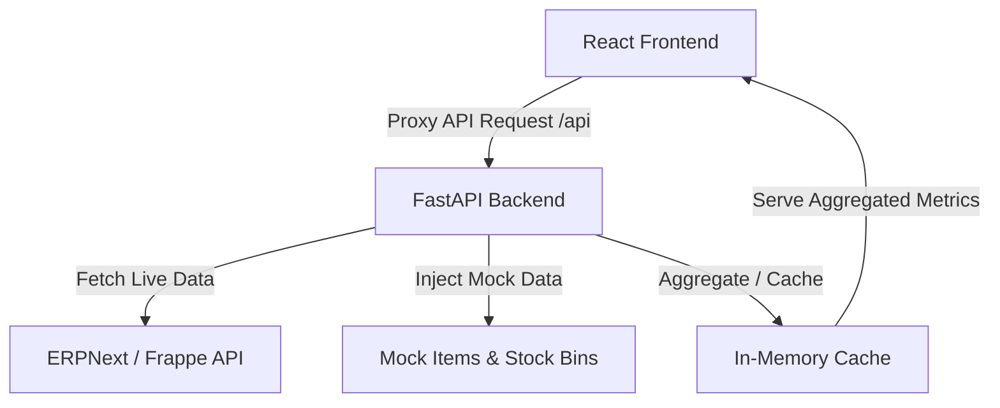

# ERP Insights Dashboard

An interactive, responsive erp-insights dashboard that integrates directly with **ERPNext (Frappe)**, aggregates sales, purchases, customers, suppliers, and stock inventories, and visualizes the aggregated metrics in real time. 

The application uses a FastAPI python backend as an API proxy and caching server to keep the dashboard responsive and avoid overloading the ERPNext server APIs, combined with a modern React + TypeScript + Vite frontend.

---

## Architecture Overview



### 1. Backend (Python + FastAPI)
* Acts as an **API Proxy** to bypass CORS limits and securely authenticate using ERPNext API tokens.
* Implements an **In-Memory Caching** system (5-minute TTL) to keep dashboard statistics snappy and reduce API overhead.
* **Data Enrichment:** Blends live retrieved data with mock inventory/items records to showcase comprehensive visualizations.
* Pre-calculates KPI counts, sales trends, supplier leaderboards, and stock valuations.

### 2. Frontend (React + TypeScript + Vite)
* Single-page web application featuring high-quality glassmorphism and modern UI design.
* Built using **Recharts** for charts (sales/purchase trends, item distributions, warehouse values).
* Styled dynamically with custom CSS and utilizing **Lucide React** for premium typography and visual cues.

---

## Repository Structure

```text
├── backend/
│   ├── .env               # Environment configuration (ERPNext URL and keys)
│   ├── main.py            # FastAPI server entry point and data processor
│   └── requirements.txt   # Python dependency declarations
├── frontend/
│   ├── src/               # React components, pages, hooks, and style utilities
│   ├── package.json       # Node package manager declarations
│   └── vite.config.ts     # Vite configurations including proxy mapping
└── README.md              # Project documentation (this file)
```

---

## Getting Started

### Prerequisites
* **Python 3.10+**
* **Node.js 18+**

---

### Setup Instructions

#### 1. Backend Server Setup
1. Navigate to the `backend` directory:
   ```bash
   cd backend
   ```
2. Activate the virtual environment:
   * **On Windows (PowerShell):**
     ```powershell
     ..\venv\Scripts\Activate.ps1
     ```
   * **On Windows (CMD):**
     ```cmd
     ..\venv\Scripts\activate.bat
     ```
   * **On macOS/Linux:**
     ```bash
     source ../venv/bin/activate
     ```
3. Install dependencies:
   ```bash
   pip install -r requirements.txt
   ```
4. Configure `.env`:
   Verify that your configuration in [backend/.env](file:///d:/l&t%20-%20internship/api%20integrated%20dashboard/backend/.env) matches your ERPNext cloud instance endpoints:
   ```env
   ERPNEXT_SITE_URL=https://your-site.frappe.cloud/
   ERPNEXT_API_KEY=your_api_key
   ERPNEXT_API_SECRET=your_api_secret
   PORT=8005
   ```
5. Start the FastAPI server:
   ```bash
   python main.py
   ```
   *The backend will boot up at `http://localhost:8005`.*

---

#### 2. Frontend Application Setup
1. Navigate to the `frontend` directory:
   ```bash
   cd ../frontend
   ```
2. Install dependencies:
   ```bash
   npm install
   ```
3. Launch the development server:
   * **Direct Command (to avoid Windows path ampersand & issues):**
     ```bash
     node node_modules/vite/bin/vite.js
     ```
   * **Standard command:**
     ```bash
     npm run dev
     ```
4. Access the web app:
   Open your browser at `http://localhost:5173`.

---

## Troubleshooting

### Windows Command Separator Issue (`'t' is not recognized`)
If your project directory includes an ampersand (`&`) (e.g., `l&t - internship`), running `npm run dev` might fail because the Windows command processor splits the path at the `&`. 

**Fix:** Bypass the npm batch scripts and start Vite directly via Node:
```powershell
node node_modules/vite/bin/vite.js
```
